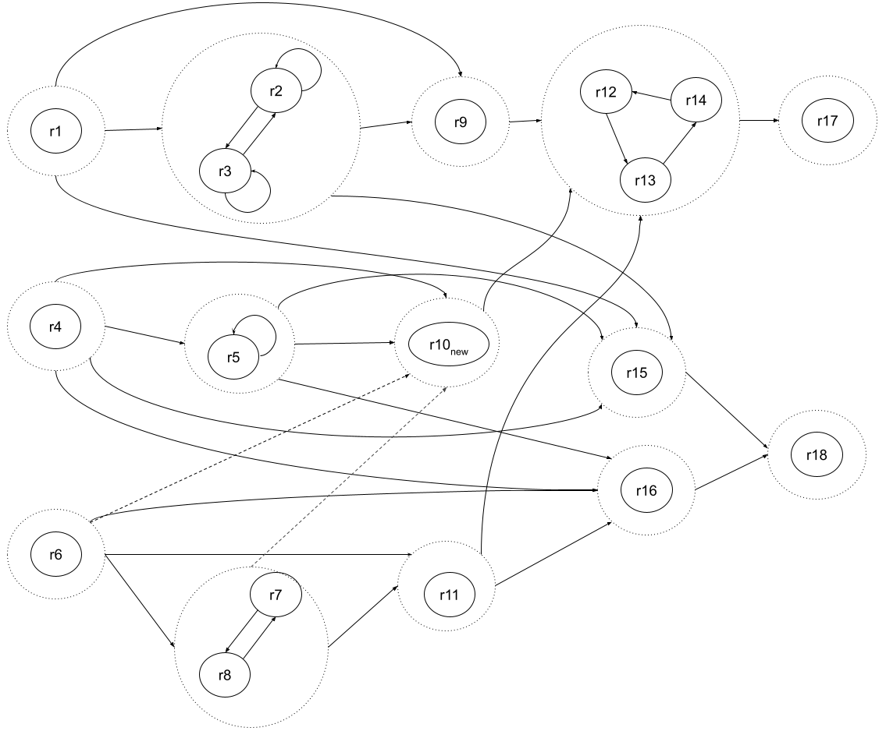

## Additional test

We additionally tested ZodiacEdge with following rule set on LUBM1, LUBM10 and LUBM100 data set. Rules marked with * are randomly picked and rules marked with # are some rules in the end of the topological order of the rule set's HRDG.

Additional test's rule set:

| * | # | rule |
|---|---|-----------------------------------------------------------|
| | |\<advisor>(?X, ?Y) :- \<src_advisor>(?X, ?Y) . |
| | |\<AssistantProfessor>(?X) :- \<src_AssistantProfessor>(?X) . |
| | |\<AssociateProfessor>(?X) :- \<src_AssociateProfessor>(?X) . |
| | |\<Course>(?X) :- \<src_Course>(?X) . |
| | |\<Department>(?X) :- \<src_Department>(?X) . |
| | |\<doctoralDegreeFrom>(?X, ?Y) :- \<src_doctoralDegreeFrom>(?X, ?Y) . |
| | |\<emailAddress>(?X, ?Y) :- \<src_emailAddress>(?X, ?Y) . |
| | |\<FullProfessor>(?X) :- \<src_FullProfessor>(?X) . |
| | |\<GraduateCourse>(?X) :- \<src_GraduateCourse>(?X) . |
| | |\<GraduateStudent>(?X) :- \<src_GraduateStudent>(?X) . |
| | |\<headOf>(?X, ?Y) :- \<src_headOf>(?X, ?Y) . |
| | |\<Lecturer>(?X) :- \<src_Lecturer>(?X) . |
| | |\<mastersDegreeFrom>(?X, ?Y) :- \<src_mastersDegreeFrom>(?X, ?Y) . |
| | |\<memberOf>(?X, ?Y) :- \<src_memberOf>(?X, ?Y) . |
| | # |\<name>(?X, ?Y) :- \<src_name>(?X, ?Y) . |
| | # |\<Publication>(?X) :- \<src_Publication>(?X) . |
| | |\<publicationAuthor>(?X, ?Y) :- \<src_publicationAuthor>(?X, ?Y) . |
| | |\<ResearchAssistant>(?X) :- \<src_ResearchAssistant>(?X) . |
| | |\<ResearchGroup>(?X) :- \<src_ResearchGroup>(?X) . |
| | # |\<researchInterest>(?X, ?Y) :- \<src_researchInterest>(?X, ?Y) . |
| | |\<subOrganizationOf>(?X, ?Y) :- \<src_subOrganizationOf>(?X, ?Y) . |
| | |\<takesCourse>(?X, ?Y) :- \<src_takesCourse>(?X, ?Y) . |
| | |\<teacherOf>(?X, ?Y) :- \<src_teacherOf>(?X, ?Y) . |
| | |\<TeachingAssistant>(?X) :- \<src_TeachingAssistant>(?X) . |
| | |\<teachingAssistantOf>(?X, ?Y) :- \<src_teachingAssistantOf>(?X, ?Y) . |
| | |\<telephone>(?X, ?Y) :- \<src_telephone>(?X, ?Y) . |
| | |\<undergraduateDegreeFrom>(?X, ?Y) :- \<src_undergraduateDegreeFrom>(?X, ?Y) . |
| | |\<UndergraduateStudent>(?X) :- \<src_UndergraduateStudent>(?X) . |
| | |\<University>(?X) :- \<src_University>(?X) . |
| | |\<worksFor>(?X, ?Y) :- \<src_worksFor>(?X, ?Y) . |
| | |\<Employee>(?X) :- \<AdministrativeStaff>(?X) . |
| | |\<Person>(?X) :- \<advisor>(?X, ?X1) . |
| | |\<Professor>(?X1) :- \<advisor>(?X, ?X1) . |
| | |\<Organization>(?X) :- \<affiliatedOrganizationOf>(?X, ?X1) . |
| | |\<Organization>(?X1) :- \<affiliatedOrganizationOf>(?X, ?X1) . |
| | |\<Organization>(?X) :- \<affiliateOf>(?X, ?X1) . |
| | |\<Person>(?X1) :- \<affiliateOf>(?X, ?X1) . |
| | |\<Person>(?X) :- \<age>(?X, ?X1) . |
| | # |\<Publication>(?X) :- \<Article>(?X) . |
| | |\<Professor>(?X) :- \<AssistantProfessor>(?X) . |
| | |\<Professor>(?X) :- \<AssociateProfessor>(?X) . |
| | # |\<Publication>(?X) :- \<Book>(?X) . |
| | |\<Person>(?X) :- \<Chair>(?X) . |
| | |\<Professor>(?X) :- \<Chair>(?X) . |
| | |\<AdministrativeStaff>(?X) :- \<ClericalStaff>(?X) . |
| | |\<Organization>(?X) :- \<College>(?X) . |
| | |\<Article>(?X) :- \<ConferencePaper>(?X) . |
| | # |\<Work>(?X) :- \<Course>(?X) . |
| | |\<Professor>(?X) :- \<Dean>(?X) . |
| | |\<Person>(?X) :- \<degreeFrom>(?X, ?X1) . |
| | |\<University>(?X1) :- \<degreeFrom>(?X, ?X1) . |
| | |\<hasAlumnus>(?X, ?Y) :- \<degreeFrom>(?Y, ?X) . |
| | |\<Organization>(?X) :- \<Department>(?X) . |
| | |\<Person>(?X) :- \<Director>(?X) . |
| | |\<Person>(?X) :- \<doctoralDegreeFrom>(?X, ?X1) . |
| | |\<University>(?X1) :- \<doctoralDegreeFrom>(?X, ?X1) . |
| | |\<degreeFrom>(?X, ?Y) :- \<doctoralDegreeFrom>(?X, ?Y) . |
| | |\<Person>(?X) :- \<emailAddress>(?X, ?X1) . |
| | |\<Person>(?X) :- \<Employee>(?X) . |
| | |\<Employee>(?X) :- \<Faculty>(?X) . |
| | |\<Professor>(?X) :- \<FullProfessor>(?X) . |
| | |\<Course>(?X) :- \<GraduateCourse>(?X) . |
| | |\<Person>(?X) :- \<GraduateStudent>(?X) . |
| | |\<Person>(?X1) :- \<hasAlumnus>(?X, ?X1) . |
| | |\<University>(?X) :- \<hasAlumnus>(?X, ?X1) . |
| | |\<degreeFrom>(?X, ?Y) :- \<hasAlumnus>(?Y, ?X) . |
| | |\<Dean>(?X) :- \<headOf>(?X, ?X1) and \<College>(?X1) . |
| | |\<worksFor>(?X, ?Y) :- \<headOf>(?X, ?Y) . |
| | |\<Organization>(?X) :- \<Institute>(?X) . |
| | |\<Article>(?X) :- \<JournalArticle>(?X) . |
| | |\<Faculty>(?X) :- \<Lecturer>(?X) . |
| | |\<Course>(?X1) :- \<listedCourse>(?X, ?X1) . |
| | |\<Schedule>(?X) :- \<listedCourse>(?X, ?X1) . |
| | # |\<Publication>(?X) :- \<Manual>(?X) . |
| | |\<Person>(?X) :- \<mastersDegreeFrom>(?X, ?X1) . |
| | |\<University>(?X1) :- \<mastersDegreeFrom>(?X, ?X1) . |
| | |\<degreeFrom>(?X, ?Y) :- \<mastersDegreeFrom>(?X, ?Y) . |
| | |\<Organization>(?X) :- \<member>(?X, ?X1) . |
| | |\<Person>(?X1) :- \<member>(?X, ?X1) . |
| | |\<memberOf>(?X, ?Y) :- \<member>(?Y, ?X) . |
| | |\<member>(?X, ?Y) :- \<memberOf>(?Y, ?X) . |
| | |\<Organization>(?X) :- \<orgPublication>(?X, ?X1) . |
| | # |\<Publication>(?X1) :- \<orgPublication>(?X, ?X1) . |
| | |\<Chair>(?X) :- \<Person>(?X) and \<headOf>(?X, ?X1) and \<Department>(?X1) . |
| | |\<Director>(?X) :- \<Person>(?X) and \<headOf>(?X, ?X1) and \<Program>(?X1) . |
| | |\<Student>(?X) :- \<Person>(?X) and \<takesCourse>(?X, ?X1) and \<Course>(?X1) . |
| | |\<TeachingAssistant>(?X) :- \<Person>(?X) and \<teachingAssistantOf>(?X, ?X1) and \<Course>(?X1) . |
| | |\<Employee>(?X) :- \<Person>(?X) and \<worksFor>(?X, ?X1) and \<Organization>(?X1) . |
| | |\<Faculty>(?X) :- \<PostDoc>(?X) . |
| | |\<Faculty>(?X) :- \<Professor>(?X) . |
| | |\<Organization>(?X) :- \<Program>(?X) . |
| | |\<Person>(?X1) :- \<publicationAuthor>(?X, ?X1) . |
| | # |\<Publication>(?X) :- \<publicationAuthor>(?X, ?X1) . |
| | # |\<Publication>(?X) :- \<publicationDate>(?X, ?X1) . |
| | # |\<Publication>(?X) :- \<publicationResearch>(?X, ?X1) . |
| | |\<Research>(?X1) :- \<publicationResearch>(?X, ?X1) . |
| | # |\<Work>(?X) :- \<Research>(?X) . |
| | |\<Person>(?X) :- \<ResearchAssistant>(?X) . |
| | |\<Organization>(?X) :- \<ResearchGroup>(?X) . |
| | |\<Research>(?X1) :- \<researchProject>(?X, ?X1) . |
| | |\<ResearchGroup>(?X) :- \<researchProject>(?X, ?X1) . |
| | # |\<Publication>(?X) :- \<Software>(?X) . |
| | # |\<Publication>(?X1) :- \<softwareDocumentation>(?X, ?X1) . |
| | |\<Software>(?X) :- \<softwareDocumentation>(?X, ?X1) . |
| | |\<Software>(?X) :- \<softwareVersion>(?X, ?X1) . |
| | # |\<Publication>(?X) :- \<Specification>(?X) . |
| | |\<Person>(?X) :- \<Student>(?X) . |
| | |\<Organization>(?X) :- \<subOrganizationOf>(?X, ?X1) . |
| | |\<Organization>(?X1) :- \<subOrganizationOf>(?X, ?X1) . |
| | |\<subOrganizationOf>(?X, ?Z) :- \<subOrganizationOf>(?X, ?Y) and \<subOrganizationOf>(?Y, ?Z) . |
| | |\<AdministrativeStaff>(?X) :- \<SystemsStaff>(?X) . |
| | |\<Course>(?X1) :- \<teacherOf>(?X, ?X1) . |
| | |\<Faculty>(?X) :- \<teacherOf>(?X, ?X1) . |
| | |\<Person>(?X) :- \<TeachingAssistant>(?X) . |
| | |\<Course>(?X1) :- \<teachingAssistantOf>(?X, ?X1) . |
| | |\<TeachingAssistant>(?X) :- \<teachingAssistantOf>(?X, ?X1) . |
| | |\<Article>(?X) :- \<TechnicalReport>(?X) . |
| | |\<Person>(?X) :- \<telephone>(?X, ?X1) . |
| | |\<Professor>(?X) :- \<tenured>(?X, ?X1) . |
| | |\<Person>(?X) :- \<title>(?X, ?X1) . |
| * | |\<Person>(?X) :- \<undergraduateDegreeFrom>(?X, ?X1) . |
| * | |\<University>(?X1) :- \<undergraduateDegreeFrom>(?X, ?X1) . |
| * | |\<degreeFrom>(?X, ?Y) :- \<undergraduateDegreeFrom>(?X, ?Y) . |
| * | |\<Student>(?X) :- \<UndergraduateStudent>(?X) . |
| * | |\<Organization>(?X) :- \<University>(?X) . |
| * | # |\<Publication>(?X) :- \<UnofficialPublication>(?X) . |
| * | |\<Professor>(?X) :- \<VisitingProfessor>(?X) . |
| * | |\<memberOf>(?X, ?Y) :- \<worksFor>(?X, ?Y) . |

| Data set | EDB size | Reason with no-* rules from scratch |	add * rules |	delete * rules | Reason with no-# rules from scratch |	add # rules |	delete # rules |
|----------|----------|-------------------------------------|---------------|------------------|-----------------------------------|--------------|----------------|
| LUBM1    | 100543   | 588.9 ms |	216.9 ms | 252.5 ms |603.7 ms	|56.3 ms	|21.5 ms|
| LUBM10   | 1272575  | 5290.4 ms	| 2347.0 ms |	3089.7 ms |5283.2 ms|	355.3 ms|	20.4 ms|
| LUBM100  | 13405381 |155433.5 ms|	106929.0 ms|	107742.7 ms| 172832.1 ms | 20736.6 ms |	26.6 ms |

(Users can import this project into **pycharm** to run the test.)

Important: Please use (Pypy 3.11 or later) or (C-python 3.8 or later) as the Python interpreter.

To run the test, users can simply execute **main.py**. **File path can be changed** in **main.py** to test different dataset.
To generate dataset with different number of wind turbines, users can modify **w_num in generate_data.py** and execute the script to get new dataset.

# Paper Appendix:

The following 3 rule sets are examples of testing ZodiacEdge. The first example is an extraction from the real case, while the two others are synthetic ones in order to test the system in more complicated cases.

## Rule Set 1

This rule set corresponds to an extract of the real-world Wind farm use case. Due to confidentiality reasons, we can not provide the complete rule set.

r1: hasNeighbour(X, Y) :- hasNeighbour(Y, X) .  
r2: hasNeighbour(X, Y) :- hasNeighbour(X, Z) and hasNeighbour(Z, Y) and COMP(X, !=, Y) .  
r3: hasNeighbourAirTemperatureMeasurementNumber(X, Z) :- aggregate( hasNeighbour(X, Y) and hasAirTemperatureMesurement(Y, T)) on X with count(T) as Z .  
r4: hasMedianAirTemperatureMeasurementNearby(X, Z) :- aggregate( hasNeighbour(X, Y) and hasAirTemperatureMesurement(Y, T)) on X with Med(T) as Z .  
r5: MoreThan3Neighbours(X) :- hasNeighbourAirTemperatureMeasurementNumber(X, N) and Comp(N, >=, 3) .  
r6: SensorAnomalyWindTurbine(X) :- hasMedianAirTemperatureMeasurementNearby(X, M) $\wedge$ MoreThan3Neighbours(X) and hasAirTemperatureMesurement(X, T) and bind(abs(T-M) as D) and Comp(D, >, 5) .  

## Rule Set 2

This rule set corresponds to a synthetic use case and is used in the Evaluation section of the paper. It corresponds to a semipositive datalog with negation. It contains symmetric, transitive rules as well as rules with atom inequality and negation on an EDB predicate. Figure 11 presents the HRDG of this rule set.

r1:	p11(X, Y) :- p1(X, Y) .  
r2:	p11(X, Y) :- p11(Y, X) .  
r3:	p11(X, Y) :- p11(X, Z) and p11(Z, Y) and COMP(X,!=, Y) .  
r4:	p12(X, Y) :- p2(X, Y) .  
r5:	p12(X, Y) :- p12(X, Z) and p12(Z, Y) and COMP(X,!=, Y) .  
r6:	p13(X, Y) :- p3(X, Y) .  
r7:	p14(X, Y) :- p13(X, Y) .  
r8:	p13(X, Y) :- p14(Y, X) .  
r9:	p20(X, Y) :- p11(X, Y) .  
r10: p20(X, Y) :- p12(X, Y) .  
r11: p20(X, Y) :- p13(X, Y) .  
r12: p21(X, Y) :- p20(X, Y) .  
r13: p22(X, Y) :- p21(X, Y) .  
r14: p20(X, Y) :- p22(X, Y) .  
r15: p25(X, Z) :- p11(X, Y) and p12(Y, Z) and not p5(Y, Z) .  
r16: p26(X, Z) :- p12(X, Y) and p13(Z, Y) and not p5(Z, Y) .  
r17: p30(X, Z) :- p22(X, Y) and p21(Y, Z) .  
r18: p31(X, Y) :- p25(X, Y) and p26(Y, Z) .  

## Rule Set 3

Rule Set 3 is an adaptation of Rule Set 2 with only one modification on rule r10. The Datalog program thus accepts negation on IDB predicates and is not a semipositive datalog program anymore. Figure 12 presents this rule set's HRDG.

r1:	p11(X, Y) :- p1(X, Y) .  
r2:	p11(X, Y) :- p11(Y, X) .   
r3:	p11(X, Y) :- p11(X, Z) and p11(Z, Y) and COMP(X,!=, Y) .  
r4:	p12(X, Y) :- p2(X, Y) .  
r5:	p12(X, Y) :- p12(X, Z) and p12(Z, Y) and COMP(X,!=, Y) .  
r6:	p13(X, Y) :- p3(X, Y) .  
r7:	p14(X, Y) :- p13(X, Y) .  
r8:	p13(X, Y) :- p14(Y, X) .  
r9:	p20(X, Y) :- p11(X, Y) .  
r10_new: p20(X, Y) :- p12(X, Y) and not p13(Y, Z) .  
r11: p20(X, Y) :- p13(X, Y) .  
r12: p21(X, Y) :- p20(X, Y) .  
r13: p22(X, Y) :- p21(X, Y) .  
r14: p20(X, Y) :- p22(X, Y) .   
r15: p25(X, Z) :- p11(X, Y) and p12(Y, Z) and not p5(Y, Z) .  
r16: p26(X, Z) :- p12(X, Y) and p13(Z, Y) and not p5(Z, Y) .  
r17: p30(X, Z) :- p22(X, Y) and p21(Y, Z) .  
r18: p31(X, Y) :- p25(X, Y) and p26(Y, Z) .  

## Figure 11

Rule set 2's HRDG

## Figure 12

Rule set 3's HRDG

# ZodiacEdge

ZodiacEdge is a prototype of RDF-Datalog-based engine for Hybird AI (Reasoning + ML/DL) written in Python, this system is typically for Edge Computing. Users are adviced to run ZodiacEdge in PyPy 3.11 environment.

ZodiacEdge supports incrementally insertion/deletion of rules/data, which makes the system fully configurable and adapted to dynamic graph-based representation of knowledge.

ZodiacEdge also supports an extension of RDF Datalog with **AGGREGATION**, **BIND**, **COMPARE** and **SELF DEFINED FUNCTIONS**, where **SELF DEFINED FUNCTIONS** can be indicated as functions trained by ML/DL. This means users can declare logical rules mixed with ML/DL in ZodiacEdge, thus we call this system a paradigm of Hybird AI.

## Usage

* Parse rules: &emsp; R = parse_rules(file)

* Parse data: &emsp; D = parse_data(file)

* Initialize ZodiacEdge: &emsp; program = Program() &emsp; \| &emsp; program = Program(data = D, rules = R)

* Data & rules manipulation:
  
  * program.add_data(D)
  
  * program.add_rules(R)
  
  * program.delete_data(D)
  
  * program.delete_rules(R)
* Check IDB size:
  * len(program.idb)
* Print IDB contents:
  * program.idb.print_content()
* Check EDB size:
  * len(program.edb)
* Print EDB contents:
  * program.edb.print_content()
* Query ZodiacEdge:
  * resultSet = program.query( 
                  &emsp;&emsp;&emsp;&emsp;&emsp;&emsp;&emsp;&emsp; subject=Term.getTerm("X", "variable"), \ 
                  &emsp;&emsp;&emsp;&emsp;&emsp;&emsp;&emsp;&emsp; predicate=Term.getTerm("http://www.w3.org/1999/02/22-rdf-syntax-ns#type", "constant"), \ 
                  &emsp;&emsp;&emsp;&emsp;&emsp;&emsp;&emsp;&emsp; object=Term.getTerm("HasPublicationDepartment", "constant") \  
                  &emsp; &emsp;&emsp;&emsp;&emsp;&emsp; ) \ 
  * print(resultSet)

### Data

* Data File Format: *.nt

* Syntax: 

  * \<subject\> \<predicate\> \<object\> .
  
  * \<subject\> \<predicate\> "string" .
  
  * \<subject\> \<predicate\> digit .
  
### Rule

* Rule File Format: *.rules

* Syntax: 

  * rule:&emsp; head :- body .
  
  * head:&emsp; atom
  
  * atom:&emsp; \<predicate\>(variable\|constant, variable\|constant)

  * body:&emsp; bodyElement &nbsp; and &nbsp; bodyElement &nbsp; and ... and &nbsp; bodyElement  &emsp; \| &emsp; AGGREGATE(bodyElement &nbsp; and &nbsp; bodyElement &nbsp; and ... and &nbsp; bodyElement) &nbsp; on &nbsp; variable &nbsp; with &nbsp; AGGRE_FUNCTION(variable) &nbsp; as &nbsp; variable

  * bodyElement:&emsp; not atom &emsp; \| &emsp; atom &emsp; \| &emsp; BIND(expression &nbsp; AS &nbsp; variable)  &emsp; \| &emsp; COMP(variable\|digit, >\|<\|=\|>=\|<=\|!=, variable\|digit)
  
  * expression:
    * Arithmetic with variables &emsp; &emsp; &emsp; example: (?x + ?y)/2
    * Self-defined-bind-function &emsp; &emsp; &emsp; example: func: neural_network(?x1, ?x2, ?x3)
      * Syntax: "func:" must be added before a function to indicate this is a self-defined-bind-function rather than an arithmetic
      * Can be customized in selfDefinedFunction.slf_defined_bind_func.py
      * Can be used as an interface between reasoning and ML/DL, put some variables' binding as the input of a function and get a classification or a confidential rate as the output of the function
      * Users can profit from other packages (e.g. Pytorch, Scikit-learn etc.) by importing them in selfDefinedFunction.slf_defined_bind_func.py
  
  * variable:&emsp; X\|?x
  
  * constant:&emsp; \<uri\>\|digit\|"string"
  
  
  * AGGRE_FUNCTION: COUNT\|MAX\|MIN\|AVG\|MED\|self-defined-aggregation-function
    * self-defined-aggregation-function correspondes to custimzed functions in selfDefinedFunction.slf_defined_aggre_func
  
  

### Attention: 
* All rules and data must be ended by "\<space\>."
* A "#" can be added to the beginning of a rule to make it a comment
* In rule files, ?x \<http://www.w3.org/1999/02/22-rdf-syntax-ns#type \> \<Concept\> can be written as \<Concept\>(?x) or \<http://www.w3.org/1999/02/22-rdf-syntax-ns#type \>(?x, \<Concept\>), while ?x \<http://www.w3.org/1999/02/22-rdf-syntax-ns#type \> ?y can only be written as \<http://www.w3.org/1999/02/22-rdf-syntax-ns#type \>(?x, ?y)
* Self defined aggregation functions can be customized in selfDefinedFunction.slf_defined_aggre_func.py
  * Only upper letters and '_' are allowed in a self-defined-aggregation-function's name
  * Functions accept a list of digital value as the input  &emsp; &emsp; &emsp; example: FUNC(lst)
* Self defined bind functions can be customized in selfDefinedFunction.slf_defined_bind_func.py
  * Only upper letters and '_' are allowed in a self-defined-bind-function's name
  * Functions accept some arguments as the input &emsp; &emsp; &emsp; example: FUNC(arg1, arg2, arg3)
* In ZodiacEdge, an RDF Datatype Object can be any thing (but it must be hashable and string-able, i.e. non-hashable or non-string-able object must be packed in an hashable and string-able object, e.g. numpy-array, pytorch-tensor, ...), while the parser only support traditional digits for now. Users can create other RDF Datatype Object by using **self-defined BIND** and **self-defined AGGREGATION**.
